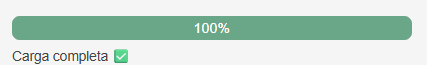
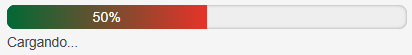
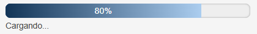
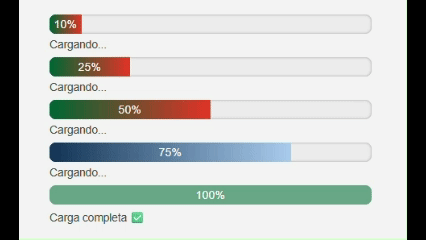
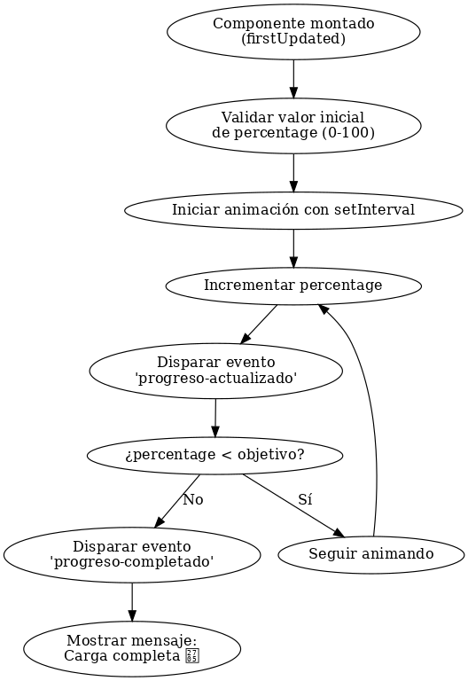

# ```<espe-progress-bar>``` — Componente de Barra de Progreso Personalizada

Nombre: Alexander Miguel Quizhpe Cuzme  
Asignatura: Programación Integrativa de Componentes 
Fecha: 26 de junio de 2025

## 🎯 Objetivo del Componente

`<espe-progress-bar>` es un Web Component basado en LitElement que representa una barra de progreso animada. Está diseñada para integrarse con proyectos web que requieran una visualización visualmente atractiva del avance de una tarea, alineada al estilo institucional de la Universidad de las Fuerzas Armadas ESPE.

---

## ⚙️ Estados Dinámicos con LitElement

Se utilizan propiedades reactivas mediante `static properties` para controlar el estado del componente. Estas propiedades permiten que la interfaz se actualice automáticamente cuando su valor cambia:

```js
static properties = {
  percentage: { type: Number, reflect: true },
  theme: { type: String, reflect: true },
  color1: { type: String, reflect: true },
  color2: { type: String, reflect: true }
};
```

- `percentage`: controla el valor de la barra (0 a 100).
- `theme`: color primario de la barra.
- `color1` y `color2`: colores para el fondo degradado.

LitElement se encarga del renderizado reactivo cada vez que una propiedad cambia.

---

## 📡 Eventos Personalizados

El componente emite dos eventos importantes:

- `progreso-actualizado`: emitido cada vez que aumenta el valor de la barra.
- `progreso-completado`: emitido cuando se alcanza el 100%.

Estos eventos permiten que otros componentes escuchen y reaccionen al progreso.

Ejemplo de escucha:

```js
document.querySelector('espe-progress-bar')
  .addEventListener('progreso-completado', () => {
    console.log('Tarea finalizada');
  });
```

---

## 💡 Ventajas de LitElement vs JavaScript Puro

| Característica                | JavaScript Puro                  | LitElement                          |
|------------------------------|----------------------------------|-------------------------------------|
| Reactividad automática       | ❌ Manual                        | ✅ Automática con propiedades       |
| Encapsulamiento con Shadow DOM | ✅ (requiere esfuerzo extra)    | ✅ Incorporado por defecto          |
| Renderizado declarativo      | ❌ HTML imperativo               | ✅ Plantillas declarativas con `html` |
| Eventos y bindings            | ❌ Más verboso                   | ✅ Simple con `@event` o `addEventListener` |
| Mantenibilidad y escalabilidad| ❌ Difícil de organizar          | ✅ Modular y limpio                 |

---

## 📦 Instalación y Ejecución

1. Clona el repositorio:

```bash
git clone https://github.com/Alexmig24/U2_Integrativa.git
cd U2_Integrativa
```

2. Instala dependencias:

```bash
npm install
```

3. Ejecuta el servidor de desarrollo:

```bash
npm run dev
```

4. Se abre en el navegador de manera local con el puerto 5173: [http://localhost:5173](http://localhost:5173)

---

## 🧪 Ejemplo de Uso
Diseño de la barra de carga finalizada
```html
<espe-progress-bar percentage="100" theme="#ffffff"></espe-progress-bar>
```
 

Diseño de la barra cuando esta cargando
```html
<espe-progress-bar percentage="50" theme="#ffffff"></espe-progress-bar>
```


Diseño de la barra cuando esta cargando pero con colores personalizados
```html
<espe-progress-bar percentage="75" color1="#123456" color2="#abcdef"></espe-progress-bar>
```
 

---
## Funcionamiento en vivo de ```<espe-progress-bar>```

 

---
## Diagrama de flujo del funcionamiento del componente

 

---

## 🧰 Estructura del Componente

```bash
docs/
├── lujo_espe_progress_bar.png
├── espe_progress_loadPersonalizado.png
├── espe_progress_load.png
├── espe_progress_complete.png
src/
├── components/
│   └── espe-progress-bar.ts
├── index.ts
index.html
.gitignore
webpack.config.js
package,js
package-lock.json
README.md
```

---

## 🛠️ Errores Comunes y Soluciones

| Error | Causa | Solución |
|------|-------|----------|
| `@property` no reconocido | Decoradores no habilitados | Se reemplazó por `static properties` |
| WebPack no carga `index.html` | Estaba en `src/` | Se movió a la raíz del proyecto |
| Colores inválidos | Valores no hexadecimales | Se validan con regex y se asigna un color por defecto |
| Progreso no animado | Se asignaba directamente `percentage` | Se animó progresivamente con `setInterval` |

---